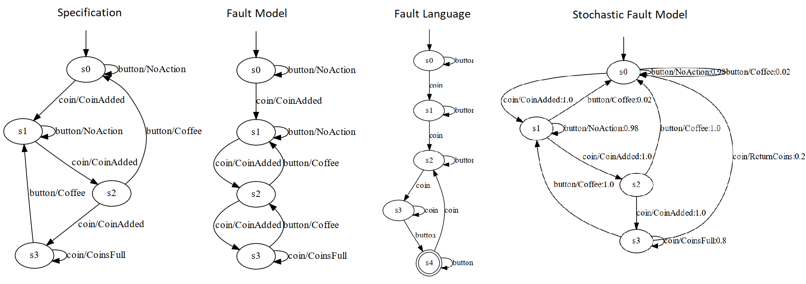

# Automata Learning Enabling Model-Based Diagnosis

In this repository, we discuss how to use active automata learning in order to tackle the problem of creating the diagnostic model. We show how to learn 
deterministic and stochastic models from reactive systems. 

On the one hand, we can learn models of faulty systems for being able to deploy model-based 
reasoning. Furthermore, we also show how to use fault models in the learning process, such as to derive a diagnostic model describing the diagnosis search 
space.

## Structure of the Repo

- `LearnedModels/` - visualized models of faulty systems and their encoding in the .dot format
- `Systems.py` - Simple systems that serve as 'System under Learning'
- `SULs.py` - A wrapper around each system, enabling active automata learning with AALpy
- `ModelLearning.py` - Collections of methods invoking automata learning procedure for each system

## Installation and Running
To download:
```bash
git clone https://github.com/DES-Lab/Automata-Learning-Based-Diagnosis
pip install aalpy
```
To run, simply run the `ModelLearning.py`. To learn any system, select the appropriate method and add it to `__main__`.